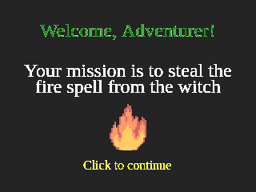
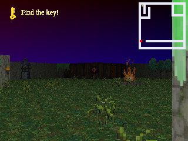
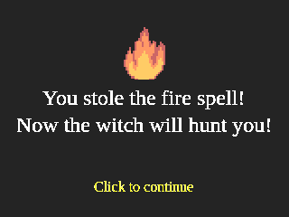
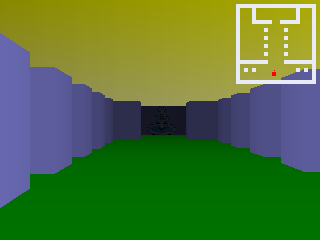

# Raycast Demo

A demo game using the [raycast-ts](https://github.com/delarco/raycast-ts) engine.

You can play the demo at [https://games.delarco.com.br/raycast-demo](https://games.delarco.com.br/raycast-demo).

## Screenshots

## Assets

### Audio

* Ballon by [LostDrone](https://www.free-stock-music.com/lostdrone-ballon.html)
* Medieval Chateau by [Alexander Nakarada](https://www.free-stock-music.com/alexander-nakarada-medieval-chateau.html)
* [Sound effects](https://opengameart.org/content/spell-sounds-starter-pack)

### Sprites

* [Camp fire](https://opengameart.org/content/camp-fire-animation-finished)
